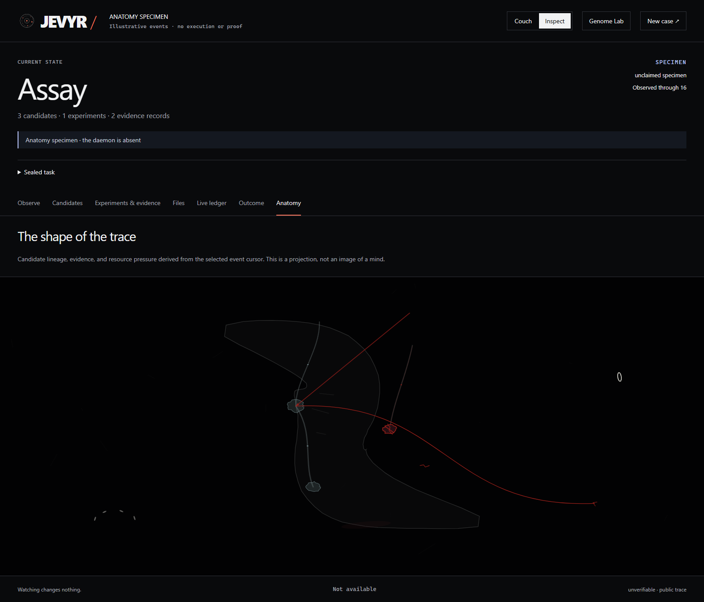
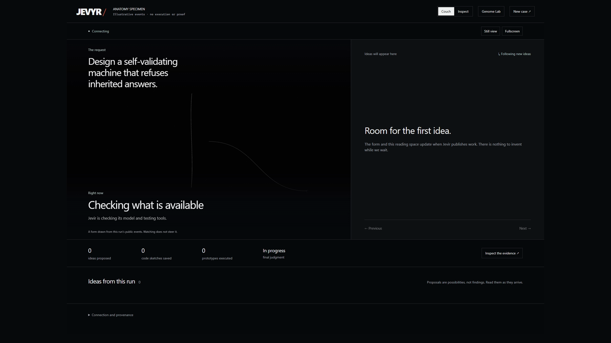
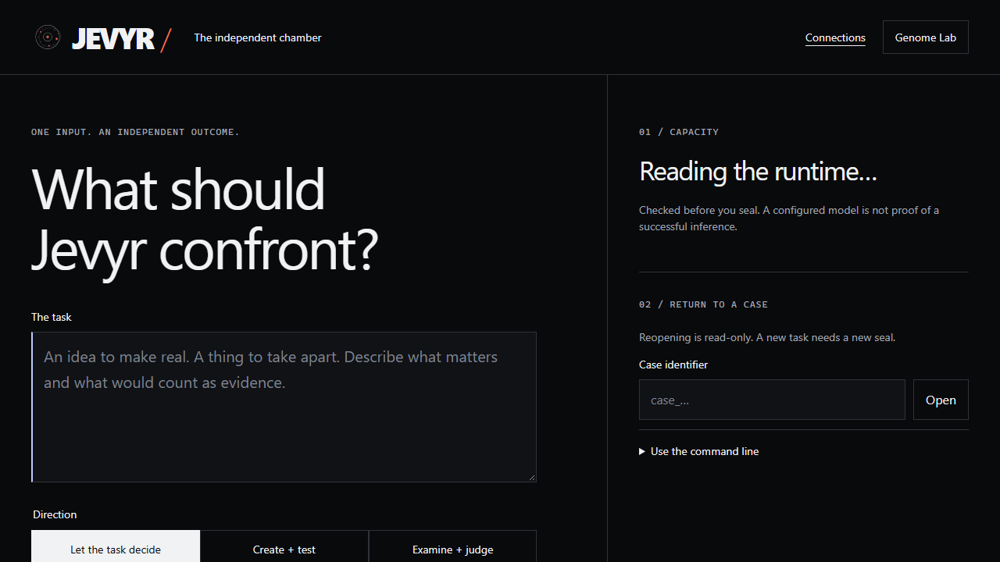
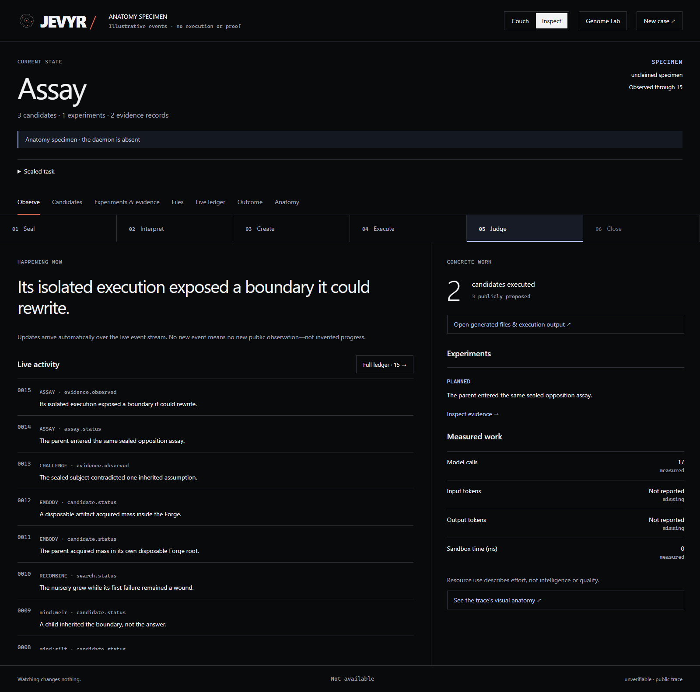

# Jevyr

## What if an AI answer had to earn trust?

> What if a model could propose anything, but nothing could be called true until
> it survived a test?

Jevyr is a local-first AI judge for claims, plans, code, and decisions. It was
built by Sondre Formo Lindheim, an independent developer exploring what AI
systems can do when they are asked to test ideas instead of only talking about
them.

The project started in early 2026. I am open-sourcing it now because it is an
experiment I want to share, inspect, and develop in public. It is my first
open-source project, and the point is to give other people something to fork,
play with, question, and turn into their own tools.

**Project status: experimental and unfinished.** This repository is shared for
inspection, learning, and further development. It is ambitious, complex, and not
something to install casually and trust with important work.

**Repository footprint:** the tracked public files in this snapshot are about
37 MB, mostly the overview video. A local development folder can grow to several
GB after installing dependencies, Docker images, caches, and generated Case
artifacts. Those files are intentionally ignored and are not part of the public
source repository.

Jevyr includes a working local MCP server, CLI, Chamber interface, TypeScript and
Python SDKs, controlled execution boundaries, and replayable evidence records.

Instead of asking one model for an answer and accepting whatever it says, Jevyr:

1. freezes the task and the information it is allowed to use;
2. asks several AI contributors to propose explanations, solutions, or tests;
3. runs selected proposals in controlled environments;
4. records what actually happened;
5. checks the evidence using deterministic rules; and
6. produces a signed record of the result.

The central idea is simple:

> Models may make claims. Evidence must decide whether those claims hold up.

Jevyr is not a chatbot, and it is not an unrestricted autonomous agent. It is a
judgment system.

## Quick start

If you are a human, fork the repository, install it, and start the Chamber:

~~~bash
corepack enable
pnpm install
pnpm build
pnpm jevyr init .
pnpm jevyr doctor
pnpm jevyr up --local-model YOUR_INSTALLED_OLLAMA_MODEL
~~~

Then open http://localhost:3001. If you are an AI agent, connect to Jevyr through
MCP and submit a Case; the short version is `jevyr mcp serve`. The full MCP
configuration is below.

Want to look around before running anything real? Open
`http://localhost:3001/?specimen=1` for an illustrative Case. The specimen is
not execution, proof, or a signed result.

## What you can explore

Jevyr is meant to be forked and played with. You can use it to:

- give a human a visible, replayable way to compare ideas and inspect evidence;
- let an AI agent test its own proposed code, plans, tool actions, or memories
  before another system relies on them;
- build custom assays for software, research, or model evaluations;
- connect a simulator or robot adapter and test plans before physical execution;
- study disagreement, candidate evolution, uncertainty, and when a system should
  say “unproven”; and
- ask open-ended questions such as “What is the most beautiful thing?” and see
  how different models interpret the question, as a subjective exploration
  rather than an objective measurement.

The intended entry point for agents is MCP. The Chamber is an optional human
window into the Case: open it when you want to watch, read, or inspect what was
recorded, but you do not need to operate the interface as a chat application.

## Why this matters

A normal AI answer might say:

> This code should work.

Jevyr tries to produce something closer to:

> This was the exact task. These candidates were proposed. These tests were run.
> These observations were preserved. These requirements were satisfied, these
> failed, and these remain unproven.

That separation matters because a model's confidence is not the same thing as
evidence.

Jevyr is not a truth machine. It can only judge a claim as supported when there
is a defined way to test it. Open-ended prompts can still be useful: for example,
asking “What is the most beautiful thing?” can produce model perspectives,
explicit criteria, comparisons, and disagreement. That is an exploration of
interpretation—not proof that one answer is universally beautiful.

## A quick look

This is a rough recording of the Chamber interface. It is a visual introduction,
not proof that a live Case ran.

The self-validating-machine prompt is the conceptual specimen. This second
illustration uses a more concrete software task: build a dependency-free parser
that rejects malformed input and reports where the error occurred. It is still a
simulation, but it shows the kind of bounded, testable work Jevyr is currently
best suited for. Run it locally with
`http://localhost:3001/?specimen=1&scenario=parser`.

[Watch the overview video](docs/media/jevyr-overview.mp4)

## The basic flow

~~~text
Task
  ↓
Airlock
  ↓
Sealed Case
  ↓
Several AI contributors
  ↓
Competing candidates and explanations
  ↓
Controlled experiments
  ↓
Evidence graph
  ↓
Deterministic judgment
  ↓
Signed and replayable Record
~~~

A Case is one complete investigation. Once it is sealed, the task cannot be
quietly edited, nudged, or corrected from the outside.

A Case can finish as:

- ACCEPT — the defined requirements were supported;
- REJECT — the requirements were contradicted or failed;
- UNPROVEN — the required evidence could not be established; or
- INVALID — the investigation itself was not trustworthy enough to use.

UNPROVEN is a valid result. Jevyr does not force certainty where the evidence is
missing.

## What Jevyr can be used for

### Humans

- Examine competing explanations instead of receiving one answer.
- Review generated code or technical designs.
- Preserve important decisions for later verification.
- Compare different models or model configurations.
- Audit a claim against a fixed collection of files.
- Teach the difference between a persuasive answer and a demonstrated result.

### AI systems

- Check generated code before it is accepted.
- Evaluate proposed tool actions.
- Test whether an agent's claims match observable results.
- Route uncertain cases to a deeper investigation.
- Compare several models on the same sealed task.
- Decide whether a piece of memory deserves to be reused.
- Create an independent record of model behavior.

### Robots and physical systems

Jevyr could eventually help robots and other physical systems to:

- test plans in simulation before physical execution;
- compare navigation, manipulation, or recovery strategies;
- investigate sensor conflicts;
- validate mission plans; and
- check whether an explanation matches recorded observations.

The current Forge is primarily a controlled software execution environment. Jevyr
does not control physical hardware by default. Robotics integrations need their
own simulator, hardware adapter, and safety boundary.

### Developers and researchers

Jevyr can also be used to study:

- multi-agent reasoning;
- model disagreement;
- candidate search and evolution;
- evidence-based evaluation;
- uncertainty and abstention;
- memory contamination;
- reproducibility; and
- model-independent benchmarks.

## How Jevyr works

### Airlock

The Airlock is the preparation area. You can edit the task, attach files, choose
privacy settings, and define what evidence should count.

When you seal the Case, those choices become fixed. After sealing, the task cannot
be rewritten, outside users cannot steer the investigation, and new semantic
instructions cannot be added.

### Minds

A Mind is an AI contributor connected to Jevyr. It may be a local Ollama model,
an LM Studio model, an OpenAI-compatible endpoint, a CLI-based model, an MCP
connection, or a custom adapter.

Minds propose and explain. They do not directly control the final judgment.

### The brain and its thoughts

Jevyr has an orchestration layer that schedules the investigation. It chooses which
bounded methods run, assigns work to Minds, manages resources, and moves the Case
through its lifecycle.

The system's "thoughts" are public, structured contributions such as claims,
interpretations, candidate designs, challenges, test plans, repairs, and
observations. Jevyr does not treat hidden chain-of-thought as evidence and does not
need to display it.

### World and life simulation

Jevyr creates small, disposable experimental worlds. A candidate can be placed in
one of them and tested against a predefined assay with fixed files, resource
limits, and no network access.

The Chamber presents this as something living: candidates appear, lineages grow,
experiments create pressure, failures remain visible, survivors become more solid,
and the Case eventually stops.

This is a visual and computational metaphor. Jevyr does not claim that its models
are alive, conscious, or sentient.

### Candidate search

Jevyr can grow competing interpretations, mechanisms, and implementation ideas.
The search tries to preserve useful diversity instead of selecting the first
plausible answer.

Candidates can have declared ancestry, different mechanisms, different failure
modes, and different resource costs. A candidate's confidence does not make it
correct. It must still survive measurement.

### Forge

The Forge is Jevyr's controlled execution boundary. It runs admitted
candidate-and-assay combinations in disposable environments.

The built-in Docker Forge is designed to provide:

- isolated execution;
- no network access;
- bounded resources;
- clean workspaces;
- separate subject and candidate material;
- content-addressed artifacts; and
- typed observations.

The Forge reports what happened. It does not decide what the result means.

### Bone

Bone is the deterministic judgment layer. It compiles the final result from the
sealed requirements, the evidence graph, completed assays, integrity checks, and
Reflex findings.

Bone does not ask a model for its opinion when producing the final judgment.

### Blood

Blood is the append-only event and evidence ledger. It records what happened, in
what order, and which digests link the objects together.

The event chain is designed to make mutation, reordering, and silent rewriting
detectable.

### Reflex

Reflex is a final consistency check. It looks for missing critical evidence,
unresolved obligations, contradictory observations, incomplete assays, broken
provenance, and other problems that should prevent an overconfident result.

Reflex is intentionally limited to two loops.

### Memory and the Genome Lab

Jevyr can keep low-weight project memory for later investigations. Memory may help
the search, but it is never automatically treated as proof.

The Genome Lab lets you compare system configurations and inspect quarantined
offspring. Changes require evidence and governance; a configuration cannot simply
rewrite the rules of a running Case.

### Couch and Inspect

The Chamber is Jevyr's visual interface.

**Couch** is the default view. It is built to be read leaning back: one Case,
one idea at a time, a quiet description of what is happening, and a few real
measurements. It is not a scrolling log and it has no approve button, comment box,
or hidden steering control.

**Inspect** shows the same Case as an instrument. It exposes phases, candidates,
experiments, evidence, files, ledger events, resource measurements, authenticated
outcomes, and the Anatomy view.

The Anatomy view is a projection of recorded events. It is not a picture of a mind.
If nothing happened in the Case, nothing should move on screen.

The Chamber is intentionally not a normal chat interface. Couch is the readable
surface for humans. Inspect is a forensic surface for reviewers and MCP clients
that need to follow a Case into its evidence. Its density is deliberate: it is
showing provenance and state, not trying to make every internal panel feel simple.
The CLI can open the Chamber when Jevyr starts; MCP itself is the agent transport
and does not need to steer a human browser.

## See the Chamber

These screenshots come from the built-in anatomy specimen and the Airlock
interface. The specimen is intentionally illustrative: it is not a signed Case
and it is not execution proof. The Airlock capture shows the interface reading
local capacity, not a failed Case.

The transparent [Jevyr mark](assets/jevyr-mark.svg) is the circular
experimental-world symbol used by the Chamber.

## MCP

Jevyr has a working MCP interface so another AI application can use it as a
judgment service. MCP is the transport layer; Jevyr remains responsible for
sealing the Case, controlling the investigation, and returning the evidence-bound
result.

The normal MCP tools are:

- submit — create a new Case;
- status — check progress;
- result — retrieve the result; and
- evaluate — submit and wait briefly for completion.

MCP is a transport layer, not a way to steer a running investigation. Each
submission creates one new Case. Jevyr does not automatically include ambient
conversation context, and there is no normal continuation or "send another hint"
endpoint.

After building Jevyr, start the daemon:

~~~bash
pnpm jevyr up --local-model YOUR_INSTALLED_OLLAMA_MODEL
~~~

Then configure an MCP client with the direct CLI entry point:

~~~json
{
  "mcpServers": {
    "jevyr": {
      "command": "node",
      "args": [
        "C:/path/to/jevyr/apps/cli/dist/main.js",
        "mcp",
        "serve",
        "--url",
        "http://127.0.0.1:4317"
      ]
    }
  }
}
~~~

Replace the path with the location of your checkout. The direct Node entry point
keeps package-manager output away from the MCP JSON-RPC stream.

## Installation

Jevyr currently requires:

- Node.js 24 or newer;
- pnpm 10 or newer;
- Docker Desktop with its Linux engine enabled; and
- a configured local or compatible AI model.

From the repository:

~~~bash
corepack enable
pnpm install
pnpm build
pnpm jevyr init .
pnpm jevyr doctor
pnpm jevyr up --local-model YOUR_INSTALLED_OLLAMA_MODEL
~~~

The local services use:

- daemon: http://127.0.0.1:4317
- Chamber: http://localhost:3001

For development, you can run both services with:

~~~bash
pnpm dev
~~~

On Windows, Start Jevyr.cmd can launch the local service after dependencies have
been installed and the project has been built.

## Run a Case

Cast a Case from the command line:

~~~bash
pnpm jevyr cast "Create a dependency-free parser with autonomous self-checks." --mode design
~~~

Watch it:

~~~bash
pnpm jevyr watch CASE_ID
~~~

Open it in the Chamber:

~~~bash
pnpm jevyr open CASE_ID
~~~

Replay a finished Case:

~~~bash
pnpm jevyr replay CASE_ID --json
~~~

A new task creates a new Case. Jevyr is not an endless conversation model.

## What is included

The repository contains:

- a local Fastify daemon;
- the Chamber browser interface;
- CLI and terminal observation tools;
- TypeScript and Python SDKs;
- local and compatible model adapters;
- MCP and A2A transports;
- sealed task input and privacy boundaries;
- candidate generation and genealogy;
- Docker-based candidate execution;
- signed Seal, Record, and terminal receipts;
- event-chain verification and evidence replay;
- Genome Lab inspection;
- bounded memory and Juggler systems; and
- optional self-judgment watching.

The strongest current support is for bounded, testable software tasks. The built-in
original-source evaluator covers a closed finite JavaScript subset. It is not a
general-purpose proof engine for arbitrary repositories or real-world claims.

## Important limitations and safety

Jevyr is complex experimental software. It is not something to install casually
and immediately trust with important work.

- Models can fail, misunderstand the task, or produce no usable candidate.
- Docker, model providers, files, and network boundaries can affect the result.
- A model's confidence is not evidence.
- A successful command by itself does not prove a broader requirement.
- UNPROVEN is often the correct result.
- Remote providers require deliberate privacy choices.
- Physical robot control is not included by default.
- The current project documentation does not claim dependable customer-workload
  reliability.
- The Chamber's anatomical display is a visualization, not a claim of machine
  consciousness.

Some security tools or antivirus products may flag software that creates isolated
processes, containers, temporary files, or sandbox-like behavior. This can be a
false positive, but Jevyr does not ask you to disable antivirus or security tools.
If your system raises a warning, stop and investigate it through your normal
security process. Review the source, verify the checkout, and run Jevyr only in an
environment you understand.

### Use at your own risk

Jevyr is provided for inspection, learning, and further development, without any
promise that it will be safe, correct, secure, available, or fit for a particular
purpose. You are responsible for reviewing its configuration, the code you run,
the models and providers you connect, and every decision or action you take based
on its output.

To the maximum extent permitted by applicable law, the author and maintainers are
not responsible for damage, data loss, security incidents, service interruption,
incorrect decisions, or any other harm resulting from the use, misuse, or inability
to use Jevyr. This notice is not a substitute for a proper open-source license or
legal review in the jurisdictions where you use it.

## Repository structure

~~~text
apps/
  daemon/       Local service and transports
  cli/          Command-line tools and MCP bridge
  chamber/      Browser interface

packages/
  protocol/     Wire formats, validation, and digests
  core/         Sealing, evidence, policy, replay, and signing
  runtime/      Orchestration, Minds, Forge, and Cases
  growth/       Candidate search and quality-diversity archives
  memory/       Temporal Deep and memory governance
  sdk/          TypeScript client

sdk/
  python/       Python client

docs/           Architecture, protocol, operations, and threat model
benchmarks/     Reproducible benchmark and release-gate material
~~~

## Design principles

1. Models may propose, but they may not certify their own claims.
2. Sealed inputs cannot be changed after an investigation begins.
3. Evidence must have a defined authority and provenance.
4. Failed candidates remain visible.
5. The system must be allowed to say “unproven.”
6. Resource usage must be bounded and recorded.
7. Results should be independently replayable where the required material exists.
8. The interface must distinguish real events from decoration.
9. Memory may influence later search, but memory is not proof.
10. Watching a Case must not steer it.

## Contributing

Useful contributions include:

- new model adapters;
- deterministic assays;
- replay and verification tools;
- benchmark cases;
- documentation and examples;
- Chamber usability improvements;
- security reviews; and
- simulation adapters for robotics.

When contributing, preserve the distinction between model output, observation,
evidence, policy, and judgment. That distinction is the foundation of Jevyr.

## Project status

Jevyr is an open-source experiment shared for inspection, learning, and further
development. The architecture is ambitious and many parts are implemented, but
the system is not presented as a finished product or a universal AI reliability
solution.

See the [architecture](docs/architecture.md), [protocol](docs/protocol.md),
[operations guide](docs/operations.md), [threat model](docs/threat-model.md), and
[release-readiness notes](docs/release-readiness.md) for deeper technical details
and the measured limits of the current build.
